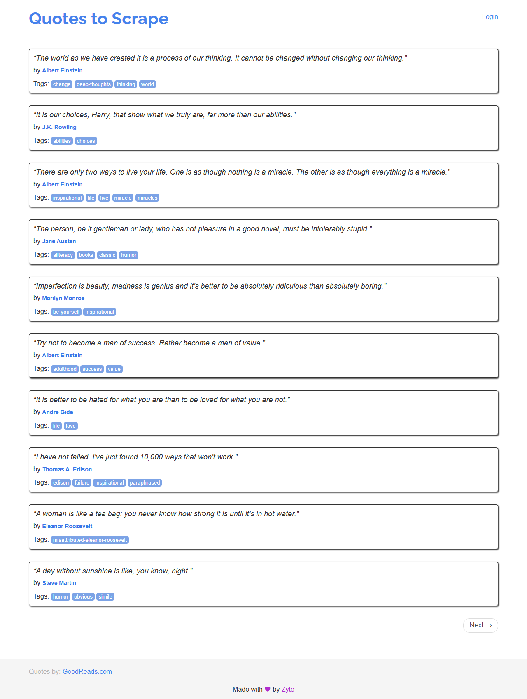

# Quotes Scraper – Browser Automation Challenge

Este proyecto es una solución al reto técnico propuesto para el puesto de Web Scraper Developer & Browser Automation Specialist. El objetivo era desarrollar un bot automatizado, modular y robusto para extraer datos de una web pública que use JavaScript y técnicas básicas anti-bot.

---

## Setup y ejecución

1. Clonar el repositorio o descomprimir ZIP:

```bash
git clone https://github.com/javivg03/book_scraper.git
cd book_scraper
```

2. Crear entorno virtual y activar:

```bash
python -m venv .venv
source .venv/bin/activate  # En Linux/Mac
.venv\Scripts\activate   # En Windows
```

3. Instalar dependencias:

```bash
pip install -r requirements.txt
```

4. Ejecutar el scraping:

```bash
python main.py
```

Los resultados se guardarán automáticamente como archivo JSON dentro de la carpeta `output/`.

---

## Decisiones técnicas

- Se eligió la web https://quotes.toscrape.com/js/ porque carga dinámicamente el contenido mediante JavaScript, simulando un caso real de scraping con JS-rendering.
- Se usó Playwright con Python en modo asíncrono para aprovechar su potencia con webs dinámicas, además de su soporte nativo para acciones humanas (scroll, clicks, delays).
- El scraping se estructuró en módulos separados (`main.py`, `scraping/navigator.py`, `exports/exporter.py`) para facilitar la reutilización y mantenimiento del código.
- El scraper está preparado para ser extendido fácilmente a otras webs cambiando los selectores y lógica de navegación.

---

## Anti-bot y evasión

Aunque la web no tiene medidas agresivas, se aplicaron técnicas comunes en la industria:

- Simulación de comportamiento humano mediante `esperar_humano()` con `asyncio.sleep` aleatorio.
- Scroll progresivo para cargar contenido (aunque en este caso no era obligatorio).
- Navegador con user-agent personalizado.
- Modularidad para incluir rotación de proxies en `navigator.py` si se necesitase.
- Control de errores durante el scraping con `try/except` por cada elemento.

---

## Output

Los resultados se exportan como un archivo `.json` en la carpeta `output/`, con esta estructura:

```json
[
  {
    "texto": "The world as we have created it is a process of our thinking. It cannot be changed without changing our thinking.",
    "autor": "Albert Einstein",
    "tags": ["change", "deep-thoughts", "thinking", "world"],
    "url": "https://quotes.toscrape.com/js/"
  }
]
```
### Captura durante la ejecución



---

## Logging y tests

- El programa utiliza logs sencillos con `print()` para informar del número de elementos encontrados y errores detectados.
- Se podría extender fácilmente añadiendo `logging` estándar o tests unitarios con `pytest`, pero se priorizó simplicidad y claridad en esta entrega.

---

## Bonus: CAPTCHA (opcional)

Esta web no requiere resolver CAPTCHAs, pero si fuera necesario:

- Se podría integrar con servicios externos como 2Captcha o Anti-Captcha.
- También se puede combinar Playwright con librerías OCR o detección automática para resolver versiones simples.

---
## Contacto
Desarrollado por Javier Villaseñor García  
